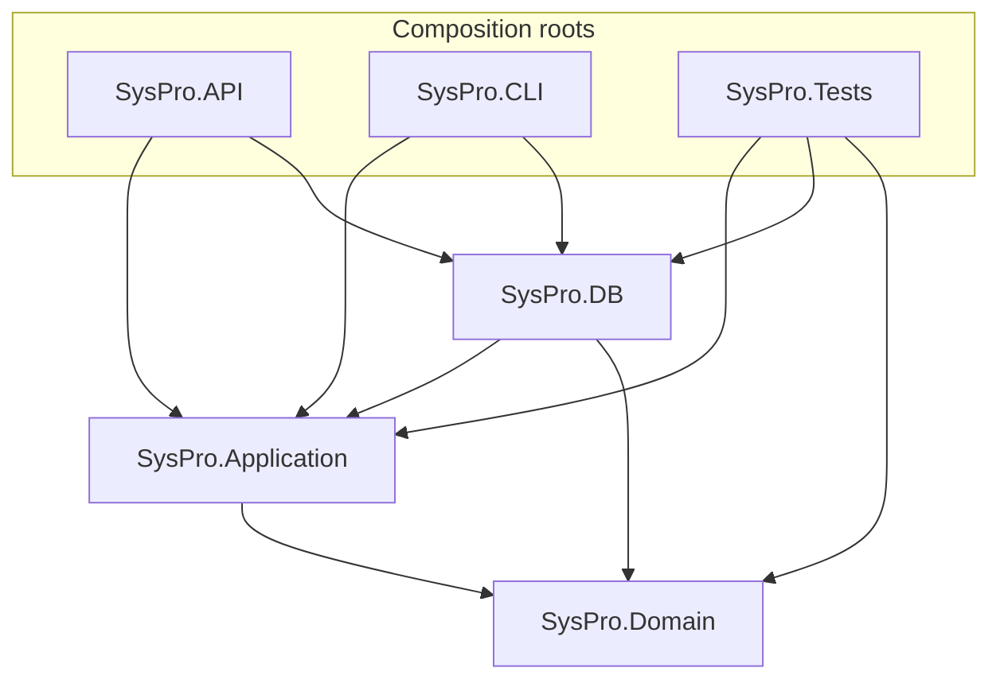

# Solution — design decisions & trade-offs

> How to build, run, and test is in [README.md](README.md). 

---

## 1. Architecture at a glance

The solution is a layered / "onion" style split with the dependency arrows all pointing inward
toward the domain. There are three composition roots (API, CLI, Tests) that wire everything up,
and the layers underneath know nothing about which root is driving them.

**What each project does, is for:**

- **SysPro.Domain** — the core of the solution: entities (`Orders`, `OrderLine`, `OrderVersion`,
  `ImportAudit`), the flat `OrderPayload` DTO, and the read/transport models (`OrdersViewModel`,
  `SummaryViewModel`, `IngestOrderModel`, `ImportAuditViewModel`). It depends on **nothing** — no
  EF, no ASP.NET, no CsvHelper. Keeping it dependency-free means the business types can't be
  quietly coupled to a framework, and every other layer can reference them without dragging
  infrastructure along. Entities are grouped by concern (`App`, `Models`, `Orders`).
- 
- **SysPro.Application** — the business logic that shouldn't care whether it's called from a CLI, an
  HTTP request, or a test: CSV discovery (`CsvFileDiscovery`), the ingestion pipeline
  (`CSVIngestion`), and the **repository interfaces** (`IOrdersRepository`, `IAppRepository`). The
  interfaces live here by design — this is dependency inversion: Application *defines the contract*
  it needs from persistence, and SysPro.DB *implements* it. So the arrow points DB → Application, not
  the other way around, and the ingestion logic never sees a `DbContext` as it doesn't need to or should.

- **SysPro.DB** — everything SQL Server: the EF Core `DbContext`, entity configurations, the
  migration, the embedded SQL (table-valued parameter types + stored procedures), the repository
  implementations, and the DI registration (`AddInfrastructure`). Keeps all Data concerns separate from business logic.

- **SysPro.API** — Minimal hosting + MVC controllers, the `OrderServices` application
  service, and the `IOrdersService` contract.

- **SysPro.CLI** — A thin console host that resolves `CSVIngestion` from DI and
  runs a folder of files through it.

- **SysPro.Tests** — xUnit. References Application + DB + Domain so it can exercise the real pipeline.

**Why ingestion lives in Application, not the API:** the spec lets you pick any ingestion entry point,
and I wanted the *same* ingestion logic reachable from both the CLI (the batch entry point) and,
potentially, an API endpoint — without duplicating it or forcing the CLI to take a dependency on
ASP.NET. Putting it in Application keeps it entry-point-agnostic and unit-testable against fakes with
no host at all.

**Why not full Clean Architecture with MediatR/CQRS.** The plain project layering here already gives
me the isolation that actually matters — a dependency-free domain and inverted persistence — without
pulling in more libraries. Every extra dependency is more attack surface and more unknowns to carry,
and MediatR/CQRS is a level of architecture a slice this small doesn't need. For a ±4h task it would
be expensive relative to the value it adds, so I kept the moving parts to what the problem justifies.
If the ingested volume grew, or there were more source systems and
more diverging read/write paths to keep separate, the isolation and pipeline structure CQRS/MediatR
buys would start to earn its cost, and I'd reconsider it then.

---

## 2. Task 1 — CSV ingestion

### The pipeline

A row's journey from disk to committed state:

1. **Discover** — `CsvFileDiscovery.GetCsvFiles` enumerates the folder, keeps only `.csv`
   (case-insensitive), and sorts **ordinally** so `orders_day_1` is always processed before
   `orders_day_2` — order matters for "latest wins".
2. **Read / parse** — `CSVIngestion.GetCsvContentFromFile` streams the file with CsvHelper
   (invariant culture, trimmed) and maps each row to an `OrderPayload`. Every row is counted as
   *Considered*; a row that fails to parse/convert is caught, counted *Invalid*, and skipped — one
   bad row never aborts the file.
3. **Validate + shape** — `ProcessCsvContext` groups the payloads by `order_external_id`, loads any
   existing versions of those orders in **one** round trip, then applies the business rules per line
   and builds a list of `IngestOrderModel` (order header + changed/new lines + a version stamp).
4. **Persist** — `OrdersRepository.InsertOrUpdateOrders` packs the orders, lines, and versions into
   three table-valued parameters and calls **one** transactional stored proc, then reads the
   generated `OrderId`s back.
5. **Audit** — `App.InsertImportAudit` writes a single row: file name, processed-UTC, considered,
   applied, invalid.

The CLI runs steps 2–5 per file in a loop and prints the Applied/Invalid tally for each.

### Key trade-offs

- **Table-valued parameters into one stored proc — not the alternatives.**
  The whole file (≤1,000 lines) is sent as three TVPs to a single stored proc that does the upsert
  set-based inside one transaction. I chose this over:
  - **Row-by-row EF inserts** — chatty (N round trips), slow, and change-tracking overhead we don't
    need for a bulk load.
  - **`SqlBulkCopy`** — great for pure inserts, but it has no upsert/versioning semantics, so I'd
    still need a staging table and a merge step on top of it.
  - **A staging table** — extra objects to create, populate, and clean up, plus concurrency
    questions if two imports overlap.

  Set-based work, a single round trip per file, and one transaction so a file either
  lands completely or not at all (`SET XACT_ABORT ON` + `BEGIN/COMMIT TRAN`). I own
  hand-written T-SQL, and **TVP columns bind by ordinal** — the `DataTable` column order in
  `BuildLinesTable` etc. must match the `CREATE TYPE` definition exactly, which is a fragile,
  test-only-catchable coupling.

- **Explicit UPDATE-then-INSERT — not `MERGE`.**
  The proc updates existing rows first, then inserts the ones that don't exist, in separate
  statements. `MERGE` would express this in one statement, but it carries enough well-documented
  footguns in SQL Server (concurrency/race issues, trigger and constraint interactions, historical
  bugs) that I'd rather have two statements I can read and reason with. The
  cost is a second pass over the data, which is negligible at this scale.

  This isn't a theoretical preference — I've had a `MERGE` go wrong badly enough that it drove
  runaway server memory and left me reconstructing the database from the transaction log to recover.
  After that, on anything that mutates data I default to explicit, separately reasoned UPDATE/INSERT
  statements unless there's a concrete reason to reach for `MERGE`.

- **Skip-and-count invalid rows — not fail the file.**
  There are two distinct failure classes and they're caught in two places:
  - **Parse / type-conversion failures** (e.g. a non-integer `qty`, a malformed date) throw inside
    CsvHelper and are caught in `GetCsvContentFromFile`.
  - **Business-rule violations** are filtered in `ProcessCsvContext`: `qty <= 0` or null, price
    `<= 0`, missing SKU, missing customer, currency ≠ `ZAR`, a missing external id or order date, or
    a duplicate `line_no` within the same order.

  The `ImportAudit` row records **Considered** (every data row read), **Applied** (lines actually
  written — new or changed), **Invalid** (rows skipped for either reason above), the file name, and
  the processed-UTC timestamp.

### Versioning model

"Latest wins" is split across three tables:

- **`Orders`** holds the latest known header. On re-import the proc updates `OrderDate` /
  `ModifiedDate` in place — there's one row per external id (enforced by a unique index).
- **`OrderLines`** are updated in place when they change: `ProcessCsvContext` reuses the existing
  `OrderLineId`, so the row is overwritten rather than duplicated. New line numbers are inserted.
- **`OrderVersion`** is an append-only trace of `(VersionNumber, VersionDate)`. `VersionNumber` is
  `previous + 1`, or `1` for a brand-new order.

A new version is only created when **at least one line is new or changed**. `IsSameLine` compares
SKU, quantity, unit price, currency, and customer; if every line in a re-import matches what's
already stored, the order produces no `IngestOrderModel` at all — no write, no version bump. That's
the behaviour the integration test pins down (identical re-import → 0 applied, no new version;
one changed line → 1 applied, version 1 → 2).

**Boundaries of this model:**
- It does **not** snapshot the line values, so you can't reconstruct what an order looked
  like at version 1; you only know *when* it changed and *how many times*.
- Versioning is per-order-per-import, not per-line: changing three lines in one file still bumps the
  order by exactly one version.

---

## 3. Task 2 / 3 — the API

Minimal hosting (`Program.cs` top-level statements) with **MVC controllers** rather than minimal-API
endpoints — controllers gave me clean attribute routing and model binding for very little ceremony,
and `OrdersController` stays thin because all the work sits behind `IOrdersService`. OpenAPI + a
Scalar reference are wired up for interactive testing.

**The flat per-line `OrderPayload` DTO.** The POST body is a *list of lines*, the same shape as a CSV
row, and it's literally the same class — `OrderPayload` carries both `[Name(...)]` (CsvHelper) and
`[JsonPropertyName(...)]` (System.Text.Json) attributes. I chose flat-and-shared over a nested
"order with lines" shape so that JSON creation and CSV ingestion flow through the *same* validation
and shaping rules. The trade-off is that the client repeats `order_external_id`, `order_date`, and
`customer_code` on every line, which a nested payload would avoid and which is arguably the more
RESTful design.

**Reads** go through stored procs mapped onto keyless EF types (`OrdersViewModel`, `SummaryViewModel`
are configured `HasNoKey().ToView(null)`) via `FromSqlInterpolated`. Using view models rather than
returning the entities keeps the read surface flat and query-shaped, and keeps EF from trying to
track or fix up navigation properties on read.

**Routing.** Each GET has a distinct template — `{id:guid}` (with a route constraint so a GUID
doesn't collide with the literal routes), `byExternal`, `by-date-range`, `summary` — because the
first cut had several parameterless GETs that "matched multiple endpoints." Distinct templates
resolve that cleanly.

**Verb choice — why the lookups are `GET`, including `byExternal`.** I use HTTP verbs by their
semantics, not by convenience: `GET` states the call is a read — it returns data and changes nothing
on the server — while `POST` is for the operations that create, edit, or otherwise mutate state
(here, only `InsertOrUpdateOrders`). Looking orders up by external id is a pure read, so it's a `GET`
even though it accepts a set of ids. The one wrinkle I'd call out honestly is that `byExternal` takes
its id array `[FromBody]`, and a GET-with-a-body isn't universally supported by clients/proxies — but
that's an argument about *how to carry the ids* (a query string like `?id=…&id=…` would be more
portable), not about the verb. Downgrading it to `POST` just to move the payload into the body would
misrepresent a read as a write, so I kept the semantics correct and would switch the transport to a
query string rather than change the verb.

---

## 4. Data model

Two schemas: **`Orders`** (`Orders`, `OrderLines`, `OrderVersion`) and **`App`** (`ImportAudits`).

| Table | Key | Notes |
|---|---|---|
| `Orders.Orders` | PK `OrderId` (GUID) | Unique index on `OrderExternalID` — the **natural key** from the legacy system. `OrderDate` typed `date`. |
| `Orders.OrderLines` | PK `OrderLineId` (GUID) | FK → `Orders` (cascade). Identified in the file by `(OrderExternalID, LineNo)`. |
| `Orders.OrderVersion` | PK `OrderVersionId` (GUID) | FK → `Orders` (cascade). Append-only `(VersionNumber, VersionDate)`. |
| `App.ImportAudits` | PK `ImportId` (GUID) | One row per file processed. |

**Deliberate choices:**

- **Natural key vs surrogate key.** `OrderExternalID` is the legacy identity and is enforced unique,
  but the primary/foreign keys are surrogate GUIDs. That keeps the internal identifier stable and
  opaque (the API exposes `OrderId`, not the legacy string) while still letting ingestion match on
  the external id.
- **GUID keys — and why not `int` identities.** The primary key is what the API hands back and takes
  in (`GET /api/orders/{id:guid}`), so it's client/HTTP-facing — and a client-facing identifier
  must not be enumerable. Auto-increment integers let anyone walk `/orders/1`, `/orders/2`, … and
  probe for records they aren't meant to see; a 128-bit GUID gives nothing to count through. GUIDs
  also let the database generate the key without a round-trip-per-row.
- **Sequential GUIDs (`NEWSEQUENTIALID()`).** Given GUID keys, `NEWSEQUENTIALID` keeps them monotonic
  so clustered-index inserts don't fragment the way random `NEWID()` would. The cost is that ids are
  server-generated, so the ingestion proc `SELECT`s the new `OrderId`s back out at the end — which it
  needs anyway to return them. The honest trade-off is that a *sequential* GUID is less opaque than a
  random one: if resistance to guessing an adjacent id mattered more than insert locality, I'd switch
  to `NEWID()` and accept the fragmentation.
- **Defaults live in the schema, not the caller.** Both the GUID keys (`NEWSEQUENTIALID()`) and the
  audit timestamps (`CreatedDate` / `ModifiedDate` / `CreateDate` / `UpdateDate` default
  `SYSUTCDATETIME()`) are defined as column defaults on the tables themselves. That's deliberate: any
  process that inserts or updates a row — this ingestion, a future job, an ad-hoc script — gets a
  valid id and a correct timestamp for free, without having to know to set them. The timestamps
  record the actual **time of the write**, generated at the database, so the stored procs never have
  to compute or pass them and can't drift or be forgotten. It keeps that concern in one place instead
  of scattered across every caller.
- **Unit price as cents.** Amounts are integer cents end to end in the domain (`int
  UnitPriceCents`), matching the legacy format, so there's no floating-point money in the C#.

**What I'd model differently (see §6):** the TVP/column stores `UnitPriceCents` as `decimal(18,6)`
even though the value is an integer number of cents, and `CustomerCode` is stored per **line**
(as `nvarchar(max)`) when it's really an order-header attribute.

---

## 5. Testing strategy

**Unit tests** run in-process against `FakeOrdersRepository` / `FakeAppRepository` — no database, no
Docker, milliseconds to run. They target the part with the actual logic, `ProcessCsvContext`:

- invalid-row classification (a `[Theory]` over each rule: bad qty, bad price, missing SKU, wrong
  currency, missing customer), null quantity, and a missing external id counting *every* line in
  that order invalid;
- mixed good/bad rows keeping the good and counting the bad;
- re-import **with** a change → version bumps and the existing `OrderLineId` is reused;
- re-import where only one of two lines changed → version bumps once, only the changed line applied;
- re-import that's **identical** → nothing produced, no version bump.

`CsvFileDiscovery` gets its own small tests for the extension filtering.

**One integration test** (`[Trait("Category", "Integration")]`) runs against a **real SQL Server**
started by Testcontainers: it applies the EF migration, ingests `import_a.csv`, asserts the committed
DB state and audit counts, then re-imports `import_b.csv` (one changed quantity) and asserts version
`1 → 2` with only the changed line applied.

**Why a real SQL Server and not SQLite / EF in-memory.** The entire persistence design *is* the risky
part — table-valued parameters, a stored proc with ordinal TVP binding, `STRING_SPLIT`, and
server-generated GUIDs read back after commit. None of that exists in SQLite or the EF in-memory
provider; those providers would **silently skip the exact code most likely to be wrong**. A test that
"passes" against them would prove almost nothing about ingestion. The Testcontainers test is the only
thing that exercises the TVP column mapping, the proc's update/insert branches, the transaction, and
the migration end to end — i.e. everything the unit tests deliberately fake out.

The test uses a fresh random external id per run, so it commits real data but stays repeatable
without a teardown step.

**What I'd add with more time: the tests as a pipeline gate.** The suite is already split so the fast
unit tests can run on every push and the Docker-backed integration test on a build agent. What's
missing is the wiring that makes that matter — a pre-build/CI step that runs the tests and **fails
the pipeline on a red result**, so a broken build can't proceed to package or deploy. Tests only
protect you if something enforces them; right now that enforcement is manual (`dotnet test`), and I'd
make it a required gate before build/deploy.

## 6. Known limitations & what I'd do with more time

This is the candid section — most of these are conscious cuts to stay near the ±4h budget, not things
I missed.

- **Duplicated ingestion logic.** `CSVIngestion.ProcessCsvContext` (Application) and
  `OrderServices.InsertOrUpdateOrders` (API) implement the *same* grouping / validation / versioning
  logic. With more time I'd extract one shared shaping method and have both entry points call it —
  right now a rule change has to be made in two places. **This is the first refactor I'd do.**
- **The summary can double-count across versions.** `Orders.GetOrderSummary` joins `OrderVersion`
  without filtering to the latest version, so an order that's been re-imported (2+ version rows)
  multiplies its line totals in the `SUM` — which is exactly the "don't count repeated submissions
  more than once" case the spec calls out. I spotted this and understand the fix (drop the
  `OrderVersion` join from the summary, since the current line values are already the latest, or
  join only `MAX(VersionNumber)`); I ran out of time to make and re-test the change. `GetAllOrders` /
  `GetOrdersByExternalId` similarly return one line row per version for the same reason.
- **Version number is read from a cross-joined result.** `previousOrder` is a `FirstOrDefault` over a
  flattened order×line×version result set, so for an order with several existing versions the
  "previous version number" it reads may not be the true `MAX`. On the third+ import that could
  produce a wrong or repeated `VersionNumber`. I'd have the lookup return the max version per external
  id explicitly.
- **No DELETE path.** Re-import updates and inserts, but a line that *disappears* from a later file
  is left in place. The model is additive/latest-wins on what's present, not a full replace.
- **No content-hash idempotency at the file level.** Identical *lines* are skipped (`IsSameLine`), so
  a byte-identical re-import writes nothing — but there's no per-file or per-order hash, so a
  one-line change re-evaluates the whole order.
- **Audit count semantics.** `Considered` counts every parsed row; unchanged lines that are skipped
  by `IsSameLine` are counted as *neither* Applied nor Invalid, so the three counts don't sum to
  `Considered`. "Applied" specifically means *rows written this import*.
- **`UnitPriceCents` type mismatch** — `int` in the domain but `decimal(18,6)` in the TVP/column.
  I'd make the storage type an integer (`int`/`bigint`) cents to match the domain and the spec.
- **`CustomerCode` modelled per line** (and `nvarchar(max)`) when it's really an order-level field.
  I'd lift it to the `Orders` header and size it sensibly.
- **No `(OrderID, LineNo)` unique constraint** in the schema — line-number uniqueness is currently
  enforced only by the ingestion logic, not the database. I'd add the constraint as a backstop.
- **Minor cleanups:** `SysPro.Core` is an empty placeholder project; the Scalar/OpenAPI reference is
  mapped unconditionally rather than only in Development; the CLI hard-codes a `csvData` fallback and
  waits on `Console.ReadLine()` (fine for a demo, not for automation).

---

## 7. AI assistance

Per my [AIPrompts.md](AIPrompts.md) log, I used an AI assistant (Claude) as a sounding board and a
research/tooling aid, not as the author of the solution. Specifically:

- **Sanity-checking my own logic** — e.g. walking back through `ProcessCsvContext` and the sproc's
  update-if-`OrderLineId` behaviour to confirm they matched my intent.
- **Refreshing me on tooling and patterns** I hadn't touched in a while — env-var-driven
  configuration, EF migrations, TVP / stored-proc plumbing, and DI wiring.
- **Diagnosing concrete errors** I hit (the `sa` login failure that turned out to be stripped
  special characters in the connection string, `dotnet-ef` not installed, the "matched multiple
  endpoints" routing clash, a DI resolution error).
- **Generating test fixture data** (CSV rows) and **drafting documentation** — the README and the
  first pass of this SOLUTION.md scaffold.

All production C# and SQL, the architecture, the data model, and the design decisions above are my
own. The AI sped up recall and boilerplate; it didn't make the calls.
